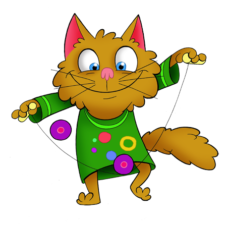

# Wildcat Jugglers Tutorial

This repository is the home of the Wildcat Jugglers Tutorial 
or Wildcat Zsonglőr oldalak in Hungarian. This is a 
statically generated site created by Rob Abram and 
David Nemeth-Csoka. 

The site's origins go back to the beginning of the century. 
It was later translated to Hungarian, went around 
multiple domains and lived in different formats. Today it's 
hosted at https://zsonglor.csokavar.hu.

To build the site, you need to run:

``` 
npm install
npm run build
```

This will set up everything and create a new version in the 
build directory.

The content can be found in the [site](site) folder in 
markdown format, from which a super simple [script](src/index.ts) 
generates the necessary html output.

The links doesn't use the .html suffix. I think it looks 
better this way. To handle these properly the following is 
to be added to your nginx config:

```
location / {
    if ($request_uri ~ ^/(.*)\.html$) {
        return 302 /$1;
    }
    try_files $uri $uri.html $uri/ =404;
}
```

Happy juggling anyone!


