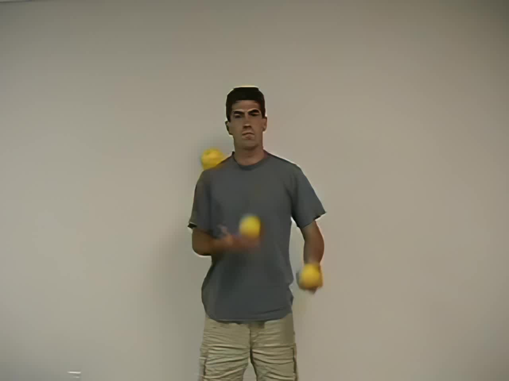

# Trükkök

A zsonglőrködés alapjait kis türelemmel bárki elsajátíthatja. Persze hosszú évekig tartó gyakorlás kell ahhoz, hogy valakiből profi zsonglőr legyen, de egy-egy trükk elsajátítása mindig újabb lökést ad a következő akadály leküzdéséhez.

Ez az oldal egy amerikai zsonglőr klub (Wildcat Jugglers) honlapjának magyar változata. Rob Abrammal, a klub vezetőjével együttműködve hoztuk létre azért, hogy azok számára is elérhetővé tegyük, akik szeretnének megtanulni zsonglőrködni, de nem tudnak eléggé angolul ahhoz, hogy eredetiben olvassák. Az évek során persze sok minden változott, a klub szünetel, sőt az eredeti oldal is elköltözött már, jelenleg [itt található](http://www.tujuggle.com/WildcatJugglers/).

## Első lépések

Lássuk, hogy lehet belőled zsonglőr…

1.  [Kaszkád - lépésről lépésre](#kaszkad-lepesrol-lepesre-html) 

## Zsonglőrködés két labdával

Ezek a trükkök magukban is érdekesek, de gyakorlásuk segít az összetettebb 3 labdás zsonglőr trükkökben, és persze a négy labdás zsonglőrködésben is.

1.  [Kör befelé](#kor-befele-html) 
1.  [Kör kifelé](#kor-kifele-html) 
1.  [Oszlopok](#oszlopok-html) 

## Zsonglőrködés három labdával

Az alapoktól a középhaladó szintig megtalálsz minden trükköt amire szükséged lehet.
### Kaszkád

1.  [Kaszkád](#kaszkad-html) 
1.  [Fordított kaszkád](#forditott-kaszkad-html) 
1.  [Fordított kaszkád, keresztezett kézzel](#forditott-kaszkad-keresztezett-kezzel-html) 
1.  [Kéz alatt](#kez-alatt-html) 
1.  [Kaszkád a fej fölött](#kaszkad-a-fej-folott-html) 

### Felül

1.  [Átadás felül](#atadas-felul-html) 
1.  ["Majdnem" koszorú](#majdnem-koszoru-html) 
1.  [Tenisz](#tenisz-html) 

### Jojó variációk

1.  [Jojó](#jojo-html) 
1.  [Ójoj](#ojoj-html) 
1.  [Dupla jojó](#dupla-jojo-html) 
1.  [Keringő jojó](#keringo-jojo-html) 
1.  [Kétoldali jojó](#ketoldali-jojo-html) 
1.  [Imitált "egyet fel, kettőt fel"](#imitalt-egyet-fel-kettot-fel-html) 

### Mills Mess variációk

1.  [Mills mess](#mills-mess-html) 
1.  [Hamis koszorú](#hamis-koszoru-html) 
1.  [Fél mess](#fel-mess-html) 
1.  [Boston mess](#boston-mess-html) 

### Hát mögötti dobások

1.  [Elkapás a hát mögött](#elkapas-a-hat-mogott-html) 
1.  [Átadás a hát mögött](#atadas-a-hat-mogott-html) 
1.  [Indítás a hát mögül](#inditas-a-hat-mogul-html) 

### Trükkös elkapások

1.  [Marok](#marok-html) 
1.  [Villa](#villa-html) 
1.  [Labda elkapása nyakkal...](#labda-elkapasa-nyakkal-html) 
1.  [Pingvin](#pingvin-html) 

### Egyet fel, kettőt fel trükkök

1.  [Egyet fel, kettőt fel - mérleg](#egyet-fel-kettot-fel-merleg-html) 
1.  [Egyet fel, kettőt fel - tenisz](#egyet-fel-kettot-fel-tenisz-html) 
1.  [Egyet fel, kettőt fel - hopp](#egyet-fel-kettot-fel-hopp-html) 
1.  [Egyet fel, kettőt fel - végtelen](#egyet-fel-kettot-fel-vegtelen-html) 
1.  [Egyet fel, kettőt fel - koszorú](#egyet-fel-kettot-fel-koszoru-html) 
1.  [Szivárvány](#szivarvany-html) 
1.  [Gyár](#gyar-html) 

### 423 trükkök

1.  [Alap 423](#alap-423-html) 
1.  [W](#w-html) 
1.  [Jobb, közép, bal](#jobb-kozep-bal-html) 
1.  [Igazi tenisz](#igazi-tenisz-html) 
1.  [Kiragadás](#kiragadas-html) 
1.  [Burke's Barrage](#burkes-barrage-html) 
1.  [Ál mess](#al-mess-html) 

### Koszorú variációk

1.  [Koszorú](#koszoru-html) 
1.  [Fordított koszorú](#forditott-koszoru-html) 

### Szögletes zsonglőrködés

1.  [Doboz](#doboz-html) 
1.  [Drop box](#drop-box-html) 
1.  [441-es](#441-es-html) 

### Vegyes

1.  [Guruló labda](#gurulo-labda-html) 
1.  [Inga](#inga-html) 
1.  [A fejed körül...](#a-fejed-korul-html) 
1.  [Hasogatás](#hasogatas-html) 
1.  [Villanás](#villanas-html) 
1.  [Láb alatt](#lab-alatt-html) 
1.  [Swoop](#swoop-html) 
1.  [Kártyakeverés](#kartyakeveres-html) 
1.  [Hamis koszorú - jojó](#hamis-koszoru-jojo-html) 
1.  [Kerge hold](#kerge-hold-html) 

## Zsonglőrködés négy labdával

Ha már jól mennek a két és háromlabdás trükkök, megpróbálkozhatsz négy labdával is zsonglőrködni. Erre a szintre nagyjából két hónap intenzív gyakorlással juthatsz el.
1.  [Szökőkút négy labdával (aszinkron)](#szokokut-negy-labdaval-aszinkron-html) 
1.  [Szökőkút négy labdával (szinkron)](#szokokut-negy-labdaval-szinkron-html) 
1.  [Oszlopok négy labdával](#oszlopok-negy-labdaval-html) 
1.  [Dugattyúk](#dugattyuk-html) 
1.  [Wimpy](#wimpy-html) 

## Zsonglőrködés öt labdával

Fél év zsonglőrködés után érdemes belefogni az öt labdás trükkökbe. Ezek már lényegesen nehezebbek, és csak kitartó gyakorlással sajátíthatók el.
1.  [Kaszkád öt labdával](#kaszkad-ot-labdaval-html) 
1.  [Szétváló labdák](#szetvalo-labdak-html) 

## Zsonglőrködés buzogánnyal

A három labdás trükkök után rögtön belevághatsz a buzogányos trükkökbe. Nem árt egy kis változatosság.
1.  [Kaszkád](#kaszkad-2-html) 
1.  [Duplázás](#duplazas-html) 
1.  ["Majdnem" koszorú](#majdnem-koszoru-2-html) 
1.  [Átadás felül](#atadas-felul-2-html) 
1.  [Megfordítva](#megforditva-html) 
1.  [Láb alatt](#lab-alatt-2-html) 
1.  [Mindkét láb alatt](#mindket-lab-alatt-html) 

## Karika zsonglőrködés

Érdemes a karikákat is kipróbálni.
1.  [Kaszkád karikával](#kaszkad-karikaval-html) 

## Miegymás

1.  [Bumeráng befőttesgumiból](#bumerang-befottesgumibol-html) 

  
 
# 441-es

A 441 egy siteswap kód. Dobj [körbe](#kor-kifele-html) két labdát az egyik kezedben majd egyet vízszintesen a másik kezedbe. Itt újra kettőt körben, aztán vissza vízszintesen. A vízszintes dobás ugyanaz mint a [Kaszkád](#kaszkad-html) és a [Koszorú](#koszoru-html) figuráknál.

# A fejed körül…

A trükk nagyon hasonlít az [Ingára](#inga-html). Alapja egy [kifelé forgó kör](#kor-kifele-html). A lényeg, hogy amikor a labda megkerüli a fejed, engedd el és kapd el azt a másik kettőből, amelyik éppen fent van.

# Ál mess

Akár hiszed, akár nem, ez a trükk nagyon közel áll a [Jobb, közép, bal](#jobb-kozep-bal-html) figurához. Miközben azt csinálod az egyik kezed nem dolgozik, csak tartja a labdát. Mindössze annyit kell tenned, hogy ezt a lustálkodó kezet átdugod a másik alatt (de ne dobd el a labdát belőle!), aztán amikor rákerül a sor, gyorsan visszahúzod és folytatod mintha misem történt volna. Ha ügyesen csinálod, nagyon hasonlítani fog a [Mills messben](#mills-mess-html) megismert oda-vissza forgáshoz.

# Alap 423

A trükköt siteswap kódja alapján neveztem el. A mintából  kis módosítással sok más trükk is származtatható. Ugyanebben a sorrendben dobálva (ugyanezzel a siteswap kóddal), de más pályán vezetve a labdákat, teljesen más figurákat kaphatunk, például: [Jobb, közép, bal](#jobb-kozep-bal-html), [W](#w-html), [Kiragadás](#kiragadas-html), [Ál mess](#al-mess-html) …

# Átadás a hát mögött

Először zsonglőrködés nélkül gyakorold be a hát mögötti dobást. Élesben arra kell majd figyelned, hogy amint elkapod a labdát, rögtön indulj el vele a hátad mögé, különben nem lesz időd befejezni a mozdulatot a következő labda érkezéséig.

# Átadás felül

Az egyik buzogányt a többi fölött dobd át, kapd el a másik kezeddel, és folytasd a zsonglőrködést.

# Átadás felül

Ezt a trükköt a [Kaszkád](#kaszkad-html) közben lehet "bedobni".   

Zsonglőrködés közben az egyik labdát felül dob át a szokásos alsó dobás helyett! Az időzítés és minden más marad ugyanaz, csak ennyi a különbség. Szebben néz ki, ha a kicsit kijjebb viszed a kezed és laposabban dobod át a labdát a többi fölött.

# Boston mess

A trükk Fél Boston mess néven is ismert. Az egyik kéz végig felül marad és egyenesen felfelé dobálja a labdákat, amikor mindhármat feldobta, elkezdi előről.

# Bumeráng befőttesgumiból

Nem zsonglőr trükk, de nagyon népszerű a zsonglőrtalálkozókon (legalábbis ahol eddig jártam). Sajnos nincs felvételem róla, mert a befőttes gumik idehaza pont olyan színűek, mint a padló… A trükk lényege, hogy ellövünk egy befőttes gumit, ami aztán bumeráng módjára visszagurul a földön.
   

Először keress pár befőttes gumit (kb. 4 és fél centi átmérőjűt). Feszítsd szét az ujjaidat (különösen a hüvelyk- és kisujjadat), amennyire csak tudod! A tenyered feléd nézzen, a mutató ujjad felfelé, a kis- és a hüvelykujjad pedig oldalra. A befőttes gumi egyik végét a kisujjadra tedd (ha nem túl hosszú a körmöd, akkor alá). A másik vége a hüvelykujjadra kerül, mégpedig úgy, hogy a gumi alsó fele kifeszüljön (a felső fele persze így nagyon laza lesz).

Fogd a meg a felső részt valahol a hüvelykujjadnál, és húzd le a kisujjadhoz. A mutatóujjaddal nyomd le a gumit a közepén, így az alsó fele mellett már a felső rész hüvelykujjad irányába eső darabja is megfeszül, csak a kisujjad felé eső darabja marad laza.

Most, miközben lenyomod a mutatóujjadat, vidd előre a hüvelykujjadat amíg a gumiban kb. 60 fokos szög alakul ki. Óvatosan hajlítsd be a hüvelykujjadat, és lődd el a gumit! Ha jól csinálod körülbelül két- három méter repülés után leesik a padlóra, és visszagurul hozzád!

Nekem egy óra alatt sikerült megtanulni, de utána nagyon fájt a kezem: ez a gyakorlat minden bizonnyal olyan izmokat igényel, amit semmi másra sem használunk. Egy jó tanács: friss befőttes gumit használj, a kinyúltak nem jók. Kezdetben valószínűleg elhasználsz párat azzal, hogy az ujjadon próbálgatod, és amikor végre sikerül ellőni, nem gurulnak vissza. Kitartás!

# Burke's Barrage

Ez a trükk nagyon hasonlít a [Kiragadáshoz](#kiragadas-html). A különbség az, hogy míg ott a kiragadott labdát körbe vezetjük a minta külső ívén, itt a másik két labda **között** húzzuk át.

# Doboz

A doboznál két labda mozog függőlegesen felváltva, egy pedig alul vízszintesen. Sajnos hajlamos vagyok arra, hogy az alsó labdát a dobás helyett átadjam egyik kezemből a másikba, ami egyáltalán nem szép. Jól gyakorold be a vízszintes dobást!

# Drop box

Ez a [Doboz](#doboz-html) egy variációja. A vízszintesen mozgó labda nem alul halad, hanem az egyik oldalon a függőlegesen mozgó labda fölött.

# Dugattyúk

Először tanuld meg az [Oszlopok](#oszlopok-html) figurát mindkét kezeddel, aztán próbáld egyszerre mindkét oldalon…

# Dupla jojó

 [Jojózz](#jojo-html) egyet valamelyik oldalon, aztán – mintha a két labda össze lenne kötve -, húzd át őket alul és jojózz a másik oldalon is.

# Duplázás

A [Kaszkád](#kaszkad-2-html) után nekiláthatsz a duplázás elsajátításának. Fent azt láthatod, milyen ha minden dobáskor kétszer pördül a buzogány a levegőben. Kezdetnek próbálj csak egy-egy duplázást beszúrni a normál kaszkádolásba.  

Duplázáskor egyszerűen magasabbra kell dobni a buzogányt. Nem kell jobban megpörgetni, csak egy kicsit magasabbra dobni. Mivel így hosszabb ideig van a levegőben, többet is pörög.

# Egyet fel, kettőt fel – hopp

Először tanuld meg az [Egyet fel, kettőt fel – mérleg](#egyet-fel-kettot-fel-merleg-html) trükköt! Ezután a középső labdát próbáld meg úgy dobni, hogy átugorjon egy labdát, aztán a másikat és ugyanígy visszafelé…

# Egyet fel, kettőt fel – koszorú

Egy másik [egyet fel, kettőt fel](#egyet-fel-kettot-fel-merleg-html) trükk. Az első labdát úgy dobd mint a [Koszorúnál](#koszoru-html), megkerülve a másik kettőt.

# Egyet fel, kettőt fel – mérleg

Miközben az egyik kezedben két labdát dobálsz egymás mellett [oszlopban](#oszlopok-html), a másik kezeddel dobálj egyet függőlegesen. Eleinte vicces lesz, mert azt gondolnád, hogy miután megtanultad az oszlopokat, már azt csinálsz a másik kezeddel amit akarsz – majd meglátod mire gondolok. Nyugi, hamar bele lehet jönni. (A ford.)

Ha már megtanultad a trükköt, a középső labdát elkapó kezet váltogathatod is. Ajánlom figyelmedbe a következő variációkat is: [Egyet fel, kettőt fel – tenisz](#egyet-fel-kettot-fel-tenisz-html), [Egyet fel, kettőt fel – hopp](#egyet-fel-kettot-fel-hopp-html), [Szivárvány](#szivarvany-html) 

# Egyet fel, kettőt fel – tenisz

Ha már tudod az [Egyet fel, kettőt fel – mérleg](#egyet-fel-kettot-fel-merleg-html) trükköt, érdemes megtanulni a középső labdát a másik kettő fölött átdobni.

# Egyet fel, kettőt fel – végtelen

Ebben az [egyet fel, kettőt fel](#egyet-fel-kettot-fel-merleg-html) trükkben az első labdát egy végtelen jelet (fektetett nyolcast) formáló úton vezesd a másik két labda körül.

# Elkapás a hát mögött

Először csak az elkapást gyakorold, zsonglőrködés nélkül. Nem olyan nehéz mint amilyennek tűnik… A lényeg, hogy az utolsó pillanatig kövesd a szemeddel a labda mozgását. Ahogy zsonglőrködés közben se a kezedet nézed, a hátad mögött is el tudod kapni a labdát: a kezed tudni fogja hová kell nyúlnia. (Oké, egy kis gyakorlás nem árt… – a ford.)

# Fél mess

Induljunk ki egy [Fordított kaszkádból](#forditott-kaszkad-html), aztán hirtelen az egyik labdát a [kezed alatt](#kez-alatt-html) dobd át, és ezzel kapd is el a következőt (még mindig a másik kezed alatt tartva)! Végül megint egy [felső dobás](#atadas-felul-html) jön, amivel körbe is értünk: már csak ismételni kell.

# Fordított kaszkád, keresztezett kézzel

Ugyanaz mint a [Fordított kaszkád](#forditott-kaszkad-html)  , csak keresztbe tett kézzel :)

# Fordított kaszkád

Nagyon szép kaszkád variáció, egyesek szerint kényelmesebb csinálni mint az alap kaszkádot.

Mielőtt belekezdenél tanulásába, tanuld meg és gyakorold be az [Átadás felül](#atadas-felul-html), a [Tenisz](#tenisz-html) és a ["Majdnem" koszorú](#majdnem-koszoru-html) figurákat. A fordított kaszkád tulajdonképpen folyamatos felső átadást jelent, mindkét kezéből. Dobáskor ne a tested túloldalát célozd meg, hanem a középvonalát, hiszen most a fogadó oldalról is felül fogsz dobni, és összeakadnának a labdák a levegőben…

# Fordított koszorú

Egyszerű: valami ilyesmit kell csinálni… Na jó, ez egy elég nehéz mutatvány… Könnyebb ha a labdákat felülről kapod el, de az takarja a nézők elől. Én időnként elütöm a labdát a csuklómmal, amikor visszahúzom a kezem felül. Ha szeretnél valami ilyesmit bemutatni, de ezt nehéznek találod, próbálkozhatsz az [Ingával](#inga-html) is.

# Guruló labda

Egyszerűen tegyél egy labdát a fejedre és hagyd, hogy leguruljon. A trükk az egészben az, hogy amint elkapod a labdát indítsd el a kezed a fejed irányába. Ha túl sokat vársz, nem lesz elég időd a műveletre…   

Nagyobb precizitást igényel, de megoldható minden (jobb kezes) labda gurítása is:

# Gyár

Mások ezt a trükköt **a gép** néven ismerik. Induljunk ki az [Imitált "egyet fel, kettőt fel"](#imitalt-egyet-fel-kettot-fel-html) figurából! Amikor a labdát fogó kezed fent van, vidd át egyenesen a túloldalra. Itt ejtsd le a labdát és gyorsan [markold](#marok-html) meg a felsőt a másik kettőből. Ereszd le a kezed, és kezdheted is elölről!

# Hamis koszorú – jojó

Sajnos nem tudom a nevét ennek a trükknek, de az egyik kedvencem. Lényegében ugyanaz mint a [Hamis koszorú](#hamis-koszoru-html), kivéve, hogy az egyik kéz lefelé néz, feljebb van és a [Jojóhoz](#jojo-html) hasonlóan követi az alatta levő labdát.

# Hamis koszorú

Mások spirál vagy szélmalom néven ismerik a trükköt. Dobj egy labdát [felül](#atadas-felul-html), egyet pedig a [kezed alatt](#kez-alatt-html) ! Az utóbbit kapd el a másik oldalon és húzd vissza, hogy a következő ütemben legyen mit felül dobnod. Akkor igazán szép a trükk, ha a dobások és a mozgatások kör alakú mintát adnak.

# Hasogatás

Ez a trükk a [Kaszkád](#kaszkad-html) egy változata. Kapj el egy labdát a felül – pályája tetején -, és gyorsan húzd át a kezed a másik két labda között. Itt dobd fel a labdát a Kaszkádnál már megszokott módon. Először érdemes egy kézzel gyakorolni, aztán lehet fejlődni…

# Igazi tenisz

A [teniszből](#tenisz-html) úgy lesz igazi tenisz, hogy az alul átadott labdákat nem egyik kézből a másikba dobjuk, hanem függőlegesen felfelé, és – mielőtt leesnének – a felülről érkező labdát vissza is dobjuk. Az elnevezés onnan ered, hogy a két függőlegesen mozgó labda olyan mintha egy teniszhálót rajzolna ki, és a harmadik labda efölött ugrál oda-vissza. A trükk tulajdonképpen a [Jobb, közép, bal](#jobb-kozep-bal-html) egy változatának is tekinthető, ha így jobban megérted…   
Az induláshoz a két labdát tartó kezedből dobj fel egyet belül, aztán gyorsan dobd át a másikat [fölötte](#atadas-felul-html). A dolgok itt kezdenek érdekessé válni… Dobd fel a másik kezedben levő labdát, és kapd el a felülről érkezőt, majd rögtön dobd is vissza (természetesen ismét felül).

# Imitált "egyet fel, kettőt fel"

Az imitált [egyet fel, kettőt fel](#egyet-fel-kettot-fel-merleg-html) figura lényege, hogy miközben az egyik kezedben két labdával játszol [oszlopban](#oszlopok-html), a másik kezedben levő labdát nem dobod fel, hanem a kezedben tartva a külső labdát követve mozgatod fel-le.

# Indítás a hát mögül

Dobd át mindhárom labdát a hátad mögött! Én az elsőt (az ujjaim felől) dobom a legmagasabbra. Kapd el a két alsó labdát és kezdj el zsonglőrködni… A legjobb ha először magad előtt dobod fel a labdákat, ha már így el tudod kezdeni, áttérhetsz a hát mögötti dobásra.

# Inga

 [Kifelé forgó körrel](#kor-kifele-html) kezdjük. A harmadik labdát tartsd fel, a könyököd legyen a levegőben, ahogy a filmen is látható. Tanuld meg a másik két labdával szinkronban előre lendíteni ezt a kezet! Ha elkaptad a ritmust, dobd el a kezedben levő labdát amikor éppen fent van egy labda a körben levők közül, azt pedig kapd el miközben visszafelé mozog a kezed.

# Jobb, közép, bal

Először tanulj meg két labdát egy kézben [egymás mellett](#oszlopok-html) dobálni. Ha ezt már elég jól begyakoroltad mindkét kezeddel, elég egyszerűnek fogod találni ezt a trükköt is, ugyanis 	itt egyszer a bal kezeddel kell függőlegesen feldobni két labdát, aztán a jobbal, és így tovább felváltva.

# Jojó

Mielőtt elkezdenéd a trükköt tanulni, érdemes megtanulni az [Oszlopok](#oszlopok-html) figurát. Az nagyjából ugyanez a trükk, csak ott nem olyan érdekes, milyen magasakat dobsz	(kevesebb ütközés). Kezdjük tehát két egymás mellett dobált labdával. A másik kéz a harmadik labdát mozgatja a belső labda fölött. Ha jól csinálod, olyan lesz mintha a két labdát egy láthatatlan szál kötné össze.

# Kártyakeverés

Kezdd [két labdával egymás mellett](#oszlopok-html) a bal kezedben. Fogj egy harmadik labdát a jobb kezedbe és tartsd fölöttük! Amikor a belső labda felér a tetőpontra, kövesd lefelé. Engedd el a jobb kezedben levő labdát, és felülről [megmarkolva](#marok-html) emeld ki a másikat az oszlopból!

# Kaszkád

A kaszkádot a [labdás kaszkádhoz](#kaszkad-html) hasonlóan tanulhatod meg buzogányokkal is.   
Kezdjük egy buzogánnyal! Adogasd 	egyik kezedből a másikba! A buzogányt a nyele közepén fogd, ne a végén! Képzelj el egy a mellkasod közepéből kiinduló, a síkjára merőleges egyenest, a buzogánynak nagyjából 45 fokos szöget kell bezárnia ezzel az egyenessel mikor a kezedben van. Dobás közben körülbelül 45 fokkal lendítsd át a túloldalra mielőtt elengeded. Ügyelj arra, hogy alacsonyakat és gyorsakat dobj! A kezdőknél gyakran megfigyelhető, hogy túl magasakat dobnak, és az egész valahogy nem tölti ki a teret. Szerintem jobb, ha a buzogány hirtelen indul és belecsattan az ember tenyerébe.

Ha már jól megy az adogatás, megpróbálhatod kettővel is. Az időzítés ugyanaz mint a labdáknál. Két buzogánnyal csak két dobást tudsz csinálni, aztán kezdheted elölről. Mindkét kezeddel gyakorold az indítást, mondjuk felváltva: bal-jobb, jobb-bal, stb. Emlékszem, hogy eleinte a bal kezem elég koordinálatlan volt, de idővel sokat javult a helyzet.

Van akinek gondot okoz egyszerre két buzogányt fogni. Én valahogy így csinálom:

# Kaszkád a fej fölött

Ez ugyanaz mint a kaszkád, csak a fejed fölött csinálod…   
Én földön fekvés közben tanultam meg, és semmi lényegi különbséget nem érzek a kettő között. A megszokott dobás helyett inkább olyan, mintha	fellöknéd a labdákat a levegőbe.

# Kaszkád karikával

A karikák feldobásakor és elkapásakor a kezed kicsit feljebb tartsd, mint a [labdás kaszkádnál](#kaszkad-html). Ezt leszámítva, gyakorlatilag ugyanaz a két mutatvány. Ha közönség előtt zsonglőrködsz, fordulj oldalra, hogy jól lássák a karikákat. Szemből gyakorlatilag észrevehetetlenek. :)

# Kaszkád – lépésről lépésre

A zsonglőrködés egyáltalán nem olyan ördöngösség, mint amilyennek látszik. Ha már láttál zsonglőrt biztosan ismered a [kaszkád](#kaszkad-html) figurát. A kaszkádot bárki megtanulhatja pár nap alatt, csak egy kis türelemre és kitartásra van szükség hozzá.

Kezdetnek vegyünk egy labdát… illetve, ha jobban meggondolom eleinte még labdára sincs szükség. Vegyünk bármit ami elég gömbölyű, nem könnyebb mint egy teniszlabda, de nem nehezebb egy biliárdgolyónál. Végső esetben egy vastagabb pár zokni is megteszi, ha sikerül elég gömbölyűre összecsomagolni…Persze a legjobb ha kéznél van néhány "hivatalosnak nevezett" zsonglőrlabda (pár száz forintos hihetetlenül akciós áron akár hármat is lehet kapni). Eleinte érdemes olyat választani, ami nem nagyon pattog, mert sajnos elég sokszor le fogod ejteni, és azt hiszem nem akarsz állandóan az asztal alatt keresgélni… Néhány babzsák vagy "footbag" például tökéletesen megfelel a célnak. Mindezek mellett válassz olyat, ami igazán tetszik, mert elég sok időt fogtok együtt tölteni…

Ha megvannak a labdák, egyelőre vegyünk elő egyet. Az alapfelállás a következő: a labdát valamelyik kézben tenyérrel felfelé tartjuk, a másik kezünkkel felkészülünk a fogadásra. Lazán dobd fel a labdát a levegőbe, és kapd el a másik kezeddel! A videó segít, ha nem sikerült elképzelni… Nagyon fontos, hogy a fogadó oldalon ne emeld fel a kezed, nem kell a labda után kapni, csak hagyd, hogy szépen belessen a tenyeredbe. Akkor lesz igazán szép, ha főleg az alkarod dolgozik, és a felkar végig a tested mellett marad. Dobás közben a labdát nézd, a kezednek érezni kell, hová kell nyúlnia!

Oké, ez egyszerű volt. Nem kell unalomig gyakorolni, előbb-utóbb úgyis belerázódsz ahogy egyre jobban elmélyülsz a zsonglőrködés tudományában. A következő lépéshez még egy labdára lesz szükség: most kettőt fogunk cserélgetni a két kezünk között. A kaszkád tanulásakor mindkét labdát felfelé kell dobni, ezt fontos megjegyezni, mert a legtöbb ember zsonglőrködés alatt a [koszorú](#koszoru-html) nevű figurát érti, és ha egyedül próbál zsonglőrködni tanulni rögtön ezzel kezdi. Ez aztán vagy nagyon sokáig tart, vagy sose sikerül… A kaszkád sokkal egyszerűbb figura, és ebből érdemes kiindulni sok más trükk tanuláskor is.

Fogj egy-egy labdát mindkét kezedbe és dobd fel az egyiket a levegőbe (kicsit szemmagasság fölé), amikor a pályája csúcsához ér, dobd fel a másik labdát is. Kapd el az elsőt, aztán a másikat. Remélem közben helyet cseréltek… Úgyis fogalmazhatunk, hogy az első labdát próbáld meg elkapni a másik kezeddel, és közben – úgy mellesleg – dobd el a másik labdát is (amit aztán kapj el az első kezeddel). A lényeg a mellesleg-en van. Arra koncentrálj, hogy elkapd a labdát, és ne arra, hogy eldobd a másikat is!

Fontos, hogy mindkét labdát dobni kell, nem átadjuk a labdát egyik kezünkből a másikba, hanem feldobjuk! Ha már próbálkoztál a koszorúval, esetleg ebbe a hibába esel…

Egy másik probléma, hogy eleinte sokan nem tudják felfelé dobni a labdákat (különösen a másodikat) inkább előre dobálják. Ha te is így jársz, keress egy üres falfelületet valahol a lakásban, és állj elé! Így a véletlenül előre dobott a labdák visszapattannak a falról, és kis ügyességgel még folytatni is tudod…

Végül egy harmadik gyakori hiba, ha valaki dobás helyett gurítja a labdát az ujjain. Erről tessék leszokni, mert nem szép! Szépen marokra fogjuk a labdát, aztán fel a levegőbe!

Ezt a lépést elég sokat kell gyakorolni, de ha már jól megy, semmi gond nem lehet három labdával sem. Fontos, hogy mindkét kezeddel meg kell tanulnod elkezdeni a figurát, nem elég csak az ügyesebbikkel. Sajnos a dolog szimmetrikus, tehát amíg nem tanulsz meg mindkét kézzel indítani, nem fogsz tudni három labdával sem zsonglőrködni… A legjobb ha felváltva csinálod, egyszer jobb kézzel indítasz, aztán ballal.

Feltéve, hogy jól begyakoroltad a fentieket, elkezdtetünk három labdával foglalkozni. Izgatott vagy, ugye? Örömmel jelenthetem be, hogy túl vagyunk a nehezén. Már csak egy harmadik labda kell, ami összeköti a bal oldali indítást a jobb oldalival, és kész is van a kaszkád! Fogj két labdát az ügyesebbik kezedbe és egyet a másikba. Az első két dobás pont olyan lesz, mint amit idáig gyakoroltál: dobd el az egyik labdád az ügyesebbik kezedből, és cseréld ki a másik kezedben levővel. Most egy labda vészesen közeledik az ügyesebbik kezed felé… Gyorsan dobd fel azt, amelyik még benne van és kapd el a másikat! Ajaj, most megint egy labda van a levegőben! Dobd fel az ügyetlenebbik kezedben levőt, és cseréld ki vele. Aztán így tovább, egy dobás jobbról, egy balról, jobbról, balról … A hangsúly most már a dobásokon legyen. Minél pontosabban dobsz, annál egyszerűbb lesz elkapni.

Ezen a ponton néhányan elakadnak. Vannak akik túl gyorsan csinálják. Nem szabad kapkodni! Akkor kell a labdát eldobni, amikor a közeledő a pályája csúcsán van. Ha megnézed a videót alul, láthatod, hogy az idő nagy részében csak egy(!) labda van a levegőben. Úgy is lassíthatsz a dolgon, hogy magasabbakat dobsz. Minél magasabbra dobod a labdát, annál több időd lesz felkészülni a fogadására. Idővel fokozatosan csökkentheted a magasságot ( [úgy jobban néz ki](#kaszkad-html) ), de egyelőre maradjunk inkább kicsivel fejmagasság fölött.

Vannak olyanok is, akik "elfelejtik" eldobni a labdát, egyszerűen csak elkapják a levegőben levőt. Dobálnak hármat-négyet aztán megállnak. Legtöbbször az a probléma, hogy nem merik elejteni a labdákat, vagy egyszerűen nem tudják, mert a kezük utánakap. Szeretném hangsúlyozni, hogy nem baj, ha leesik a labda. Ez a természetes, hiszen vonzza a Föld! A lényeg az, hogy a fogadó kézben levő labdát fel kell dobni. Ahelyett, hogy utánakapsz a másiknak, kényszerítsd magad arra, hogy eldobd a kezedben levőt, és csak ezután keresd meg az elgurult labdát a földön!

# Kaszkád öt labdával

Mindenek előtt tanuld meg a [Villanást](#villanas-html), és esetleg próbálj ki pár trükköt négy labdával (erre ugyan nincs szükség a figurához, de segít megszokni, hogy egynél több labda van a levegőben). A trükk – nevéhez hűen – nagyon hasonlít a három labdás kaszkádhoz, csak kettővel több labdával… Az első három dobás ugyanaz mint a villanásban, ezután már "csak" annyi a dolgod, hogy amikor egy labda visszaesik egy másikat dobsz fel helyette.   

Tanácsok az első lépésekhez:

1. Használj babzsákot, úgy kevesebb időt kell a leesett labdák keresgélésével töltened!
1. Gyakorold szorgalmasan a villanást!
1. Zsonglőrködés közben felfelé nézz – én már ez első dobás előtt felnézek. Vannak, akik a röppálya tetejét nézik, és olyanok is, akik a metszéspontot a csúcs alatt.
1. Valójában lassabb és kiegyensúlyozottabb a dolog mint amilyennek tűnik. Amikor először csináltam, nagyon kapkodtam és túl feszült is voltam. Csak nyugalom!
1. Ne nagyon mozgasd a könyöködet… az a jó, ha a tested mellett van, és nem verdes össze-vissza.
1. Mint minden zsonglőr trükknél, itt is a dobások a fontosak: ha jók a dobások, könnyű lesz elkapni is…
1. Ha esetleg gondot okozna, hogy tarts egyszerre három labdát a kezedben, mellékelek egy képet is. Máshogyis lehet, de nekem így kényelmes. A számok azt mutatják, milyen sorrendben dobom fel a labdákat.

  

# Kaszkád

A zsonglőrködés alapfigurája. Röviden úgy foglalhatnánk össze, hogy mindig amikor egy labda eléri a pályája csúcspontját, feldobunk egyet a másik (fogadó) oldalról.   
Kezdetben sokan előre dobják a labdákat, mert még nem tanulták meg őket felfelé dobni (nehezebb mint ahogy hangzik). Ha Neked is ez a problémád, próbálj meg a fal elé állva gyakorolni. A cél, hogy ne érintsd a falat. Ha mégis nekidobsz egy-egy labdát, az visszapattan, így egy kis ügyességgel folytathatod a gyakorlást…
Mivel feltehetőleg ezt a trükköt fogod először megtanulni, készítettünk egy hosszabb [leírást](#kaszkad-lepesrol-lepesre-html) is hozzá.

# Kerge hold

Induljunk ki egy [kifelé forgó körből](#kor-kifele-html). A harmadik labda soha nem hagyja el a kezed, csak megkerüli az éppen felül levőt.

# Keringő jojó

A [Kör kifelé](#kor-kifele-html) és a [Jojó](#jojo-html) figurák kombinációja. Kezdd egy kifelé forgó körrel, és kövesd az egyik labdát a kezeddel!

# Kétoldali jojó

Erről nem sokat tudok mondani. Csak próbálgasd…

# Kéz alatt

Dobj át egy labdát a kezed alatt. Mi mást is mondhatnék?

# Kiragadás

A legfontosabb ennél a figuránál, hogy ne akard megérteni… [kaszkáddal](#kaszkad-html) indíts, aztán az egyik pillanatban a fogadó kezed helyett az indító kezeddel nyúlj a labdáért (persze előtte dobd fel a benne levőt), és vezesd végig a minta külső ívén. Eközben a másik kéz [oszlopban](#oszlopok-html) dobálja a maradék két labdát. Amikor körbeértél, dobd át a labdát a másik kezed alatt, most az lesz a kiragadó kéz és a minta folytatódik… Könnyebb mint gondolnád, csak nem szabad gondolkodni!   

  Nekem úgy sikerült a trükköt megtanulni, hogy először begyakoroltam két labdát egymás mellett dobálni a kezem alatt. Amikor ez már jól ment, a felső kezemben tétlenkedő labdát próbáltam átemelni a másik kettő fölött. – A fordító megjegyzése 

# Kör befelé

A labdák körben haladnak a tested középvonala felé.   Ügyelj arra, hogy a kör párhuzamos legyen a mellkasoddal, a kezed pedig oldalirányban mozogjon, ne előre-hátra! (Ha már jól megy az ügyesebb kezeddel, tanuld meg a másikkal is! – a ford.)

# Kör kifelé

A labdák körben haladnak, belülről indítva az oldalad felé.   Ügyelj arra, hogy a kör párhuzamos legyen a mellkasoddal, a kezed pedig oldalirányban mozogjon, ne előre-hátra!
Ha [négy labdával](#szokokut-negy-labdaval-aszinkron-html) is akarsz zsonglőrködni, mindkét kezeddel nagyon jól kell tudnod ezt a trükköt.

# Koszorú

Ez az a trükk, amit a legtöbben elkezdenek próbálgatni, amikor zsonglőrködni tanulnak. Ugyanakkor ez nem a legjobb kezdés… Első trükknek a [Kaszkádot](#kaszkad-html) érdemes megtanulni, a Koszorú ugyanis **sokkal** gyorsabb. 

Kétféle dobást kell megtanulnod. A jobb kezedből magasan, ívesen kell dobni, a balból pedig vízszintesen. Fogj két labdát a jobb kezedbe, egyet a másikba! Dobd fel az egyiket a jobb kezedből. Ezután minden ütemben két labdát kell eldobni: egyet jobbról, egyet balról.

# Láb alatt

Ez a trükk buzogánnyal is olyan könnyű, mint a [labdákkal](#lab-alatt-html) volt. A legfontosabb itt is az, hogy amint elkapod a buzogányt, indulj el vele a lábad felé. Nem szabad várni, amíg a dobásra kerül a sor. Ha nem vagy elég hajlékony :), a buzogányt a végénél fogd meg, így kicsit könnyebb a lábad alatt átlendíteni.

# Láb alatt

A trükk lényege, hogy amint elkapod a labdát, rögtön kezdj a lábad felé közelíteni. Ha ugyanis túl sokat vársz, nem lesz időd a dobásra, mielőtt a következő labda megérkezik.

# Labda elkapása nyakkal…

Dobj egy labdát egy kicsit magasabbra mint általában! Figyeld a mozgását ameddig csak lehet, majd az utolsó pillanatban hajolj előre és próbáld meg a nyakaddal elkapni! A trükk kulcsa, hogy a lehető legtovább nézd a labdát… Nem szeretem ahogy a kezeim állnak ezen a videón, de az embernek fel kell emelni a fejét és a vállát ahhoz, hogy a leeső labdának megfelelő "leszállópályája" legyen a hátán. Először babzsákkal érdemes próbálkozni, hogy ne kelljen annyit keresgélni az elgurult ladákat…

# "Majdnem" koszorú

A labdákhoz hasonlóan, a "Majdnem" koszorú előfeltétele itt is az [Átadás felül](#atadas-felul-2-html) biztos ismerete. A trükk mindössze annyiból áll, hogy az egyik irányba folyamatosan felül dobjuk a buzogányt. Ennél a dobásnál a buzogányt egészen végén, a csomónál fogom meg.

# "Majdnem" koszorú

Ha már elég jól megy az [Átadás felül](#atadas-felul-html)  , megpróbálkozhatsz a "majdnem" koszorúval.   
Csak annyi a különbség, hogy egyik irányban mindig felül kell dobni a labdát.

# Marok

A trükk lényege, hogy a labdákat nem alulról, hanem tenyérrel lefelé – felülről – kapjuk el. Először próbálj csak egy kézzel "markolni". Például, próbálj meg kaszkádolás közben egy-egy labdát felülről elkapni. Ha ezt már jól begyakoroltad, tanuld meg folyamatosan csinálni, aztán jöhet ugyanez a másik kezeddel. Végül megpróbálhatod mindkét kezeddel folyamatosan is.   

# Megfordítva

A normál [kaszkád dobás](#kaszkad-2-html) helyett, a buzogányt fordítva pörgetjük meg a levegőben. Ezt először gyakorold be egy kézzel. A lényeg, hogy dobáskor a buzogány nyelét kell megemelni.   

# Mills mess

A Mills mess nagy kedvenc lehet, ha valahogy sikerül megérteni… 

Először csak a kézcserélgetést tanuljuk meg. Tedd a jobb kezed a bal fölé, cseréld fel őket (a bal legyen felül), aztán vissza. Eddig egyszerű, de azért gyakorold egy kicsit, hogy ezzel se kelljen foglalkozni a továbbiakban.

Oké, most gyakoroljunk két labdával! Mindkét kezedben egy-egy labdával tedd a jobb kezed a bal fölé. A jobb kezedből dobd el a labdát visszafelé (a jobb oldaladra). Nyisd szét a karjaidat és dobd el a bal kezedben levő labdát is. Tedd a bal kezed a jobb fölé és kapd el a labdákat: az elsőt bal kézzel, a másikat jobbal. Gyakorold be úgy is, hogy a bal kezed van felül!

Most vedd elő a harmadik labdát, és fogd az felső kezedbe. Ezt utoljára dobd fel, a fenti mozdulatsor végén, és csinálj vele egy kis cserét. Gyakorold mindkét irányba!

Ha már elég gyakorlott vagy, jöhet a két mozdulatsor összekötése. Ez előző gyakorlat végén levő csere nem része a Mills mess-nek, csak arról van szó, hogy így lehet jól részekre bontani a mutatványt. Most azt javaslom, menj fel az oldal tetejére, és nézd meg az egész trükköt újra. Figyeld meg, hogy a három labdából kettő nyolcas alakú pályán követi egymást, a harmadik pedig csak alul utazik.

Visszatérve az utolsó videóra láthatod, hogy a végén a felső kézben egy labda van. A következő feladat, hogy amikor ezt a labdát elkapod, dobd vissza. Ez a dobás ugyanolyan lesz mint a legelső dobás volt, csak a másik kezeddel és a másik irányba. (Na ezért kellett begyakorolni mindkettőt.) Innentől ugyanúgy kell folytatni, mint először, csak most mindent fordítva csinálunk. Arra figyelj, hogy amikor a kezeid keresztben vannak, a felső kézből dobd át a labdát a másik oldalra, aztán szét a kezeket és kézcsere (a másik legyen felül). Próbáld a két felső labdát jól dobni, és reménykedjünk, hogy a harmadik köben megtalálja az utat alul…

# Mindkét láb alatt

Ha már megy a [láb alatti dobás](#lab-alatt-2-html), ez lehet a következő lépés.

# Ójoj

Az Ójoj egy felfordított [Jojó](#jojo-html).

# Oszlopok négy labdával

Ez a trükk nagyon hasonlít az [Egyet fel, kettőt fel – mérleg](#egyet-fel-kettot-fel-merleg-html) figurára, kivéve, hogy az "egyet fel" itt most "kettőt fel" jelent.

# Oszlopok

A labdák egymás mellett haladnak, párhuzamosan.   Figyelj arra, hogy a kezed csak oldalra mozogjon, ne előre-hátra!

# Pingvin

A pingvin lényege, hogy a labdákat a kezedet hátrafordítva kapod el. (A mozdulat ugyanaz, mint a hát mögötti elkapásnál.)

# Swoop

Induljunk ki [két egymás mellett](#oszlopok-html) dobált labdából! A harmadik labdát emeld a fejed fölé, ahogy a filmen látszik! Amikor a másik oszlop felér a tetőpontra, engedd el a labdát, és [kapd el](#marok-html) a másikat. Figyeld meg, hogy a középső labda végig a saját oszlopában marad! A fent elkapott labdát ereszd le, majd dobd fel egyenesen! Egyszerűbb mint ahogy hangzik…

# Szétváló labdák

A háromlabdás [Kaszkád](#kaszkad-html) biztos ismeretében nyugodt lélekkel állhatsz neki a trükk elsajátításának. Tulajdonképpen ez az egyik "legegyszerűbb" ötlabdás trükk, szinte pontról-pontra megyegyezik a kaszkáddal, legalábbis ha már sikerült jól begyakorolni…   

Nézzük apránként:
1. Fogj három labdát a jobb kezedbe (illetőleg az ügyesebbikbe), kettőt pedig a másikba.
1. A jobb kezedből egy labdát dobj át a balba.
1. A fogadó oldalon dobd fel a két labdát úgy, hogy szétválva, egyik a bal, másik a jobb kezedbe essen.
1. Most a jobb kezedből dobj fel két labdát ugyanígy, és ezzel körbe is értünk…

# Szivárvány

A szivárvány az [Egyet fel, kettőt fel – mérleg](#egyet-fel-kettot-fel-merleg-html) figura egyszerű variációja. Ahelyett, hogy a két külső labdát felfelé dobod, dobd őket át a másik kezedbe. Az egyetlen probléma az lehet, hogy összeütköznek a labdák. Én mindig a jobb kezemből induló labdát dobom felül, de vannak olyanok is, akik nem egymás fölött, hanem egymás előtt dobják a labdákat.

# Szökőkút négy labdával (aszinkron)

Mielőtt a trükköt megtanulhatnád, mindkét kezeddel jól be kell gyakorolnod a [Kör kifelé](#kor-kifele-html) figurát. Fogj két-két labdát mindkét kezedbe! Dobj fel egyet az egyik oldalról, majd amikor eléri a pályája csúcsát dobj egyet a másikról. Közben az első labda már majdnem leesett, így itt az idő kicserélni a kezedben levővel. Végül a negyedik labda indul a másik kezedből. Mindkét kézben körbe haladnak a labdák, és soha nem cserélnek kezet!

# Szökőkút négy labdával (szinkron)

Mielőtt a trükköt megtanulhatnád, mindkét kezeddel be kell gyakorolnod [Kör kifelé](#kor-kifele-html) figurát. Fogj két-két labdát mindkét kezedbe! Ebben a trükkben mindkét oldalról egyszerre indulnak a labdák, ezen kívül csak csináld ugyanazt, amit a két labdás figuránál. Figyeld meg, hogy a labdák nem cserélnek kezet!

# Tenisz

A tenisz az [Átadás felül](#atadas-felul-html) egy variációja.   

Először dobj át egy labdát a többi fölött, aztán amikor megint erre a labdára kerül a sor, ne alul, hanem felül dobd vissza. Ezentúl ez a labda mindig a társai fölött utazik jobbra-balra… Itt is ugyanazt tanácsolom mint a felső átadásnál:	a trükk jobban néz ki, ha egy kicsit kijjebb visszed a kezed dobás előtt, így a labda egy kicsit laposabb íven repül.

# Villa

Ezzel a trükkel el tudsz kapni egy labdát kezed hátulján. Feszítsd ki a mutató- és a középső ujjadat, és hagyd hogy a labda belessen az így kialakított "villába". Van aki a mutató mellett a gyűrűs ujját használja, a középső ujját pedig egy kicsit lejjebb engedi. (Én is így csinálom a videón.) Az ütközés erejét csillapíthatod, ha a beérkezéskor kicsit lejjebb viszed a kezed – követve a labda haladási irányát. A lényeg, hogy ne pattanjon le a kezedről…

# Villanás

A villanás közben **mindhárom** labda a levegőben van. Dobd fel a labdákat gyors egymásutánban a levegőbe, és próbálj meg tapsolni, hogy megbizonyosodj: tényleg üres a kezed. Ez az öt labdával való zsonglőrködés első lépése. Ott egyszerre hármat kell a levegőben tartani, amikor pedig leesik egy, egy másik indul fel helyette.

# W

Ez a trükk majdnem azonos a [Jobb, közép, bal](#jobb-kozep-bal-html) figurával, csak a középső labda nem függőlegesen mozog, hanem jobbra-balra egy szélesebb szakaszon.

# Wimpy

A labdák egymás útját keresztezik, majd a másik kézben landolnak. Ha páros számú labdával így zsonglőrködsz, azt mondják határozatlan vagy. (Wimpy magyarul: határozatlan, döntésképtelen.) Szerintem ez rossz név, hiszen elég nehéz mondjuk tíz labdával **határozatlanul** zsonglőrködni. Mások **szinkron keresztezésnek** is nevezik, ami találóbb, de nem olyan fülbemászó.

 **Nem-wimpy** módnál a labdák nem cserélnek kezet (fele itt, fele ott). Lásd például a [Szökőkút](#szokokut-negy-labdaval-szinkron-html) és [Dugattyúk](#dugattyuk-html) figurákat.

